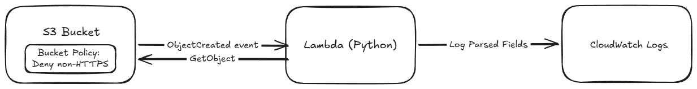

# Sixth Street Take-Home — S3 + Lambda File Processor

An AWS CDK (Python) app that provisions an S3 bucket, a bucket policy, and a
Lambda that parses single-line files as they land in the bucket.

## Architecture



A file uploaded to the S3 bucket triggers the Lambda via S3's native
`ObjectCreated` event notification (no queue or topic in between — a single
consumer with no fan-out doesn't need one). The Lambda reads the file back
via `GetObject`, splits its single line on commas, and logs the parsed
fields to CloudWatch. The bucket carries an explicit policy denying any
request that isn't using TLS (`aws:SecureTransport: false`).

**Assumption, stated plainly:** the assignment doesn't define the uploaded
file's format, so this assumes comma-separated values — the most common
plain-text convention. That assumption is documented in `lambda/handler.py`
and enforced nowhere else, so it's easy to change if the real format turns
out to be different.

## Repo layout

```
.
├── app.py                        # CDK app entrypoint
├── takehome_stack/
│   └── takehome_stack.py         # S3 bucket + policy + Lambda + event wiring
├── lambda/
│   └── handler.py                # the file-parsing logic
├── tests/unit/
│   ├── test_takehome_stack.py    # CDK synthesized-template assertions
│   └── test_handler.py           # Lambda logic unit tests (mocked S3)
├── docs/
│   ├── design.md                 # design rationale — why each ambiguous
│   │                                assignment gap was resolved the way it was
│   └── images/architecture.png   # the Excalidraw diagram embedded above
└── .github/workflows/
    ├── ci.yml                    # runs tests + cdk synth on every push/PR
    └── deploy.yml                # manual, OIDC-authenticated cdk deploy
```

## Deploying

Requires the AWS CDK CLI and an AWS account with credentials configured —
`aws configure` for a manual/local deploy, or the assumed IAM role
**`sixth-street-takehome-github-actions-deploy`** used by the GitHub
Actions workflow below (details in "Deploying via GitHub Actions"). Either
way, this repo doesn't include or require any stored credentials.

```bash
python3 -m venv .venv
source .venv/bin/activate
pip install -r requirements.txt

# One-time per AWS account/region:
cdk bootstrap

# Deploy:
cdk deploy
```

`cdk diff` before deploying shows exactly what would change. `cdk destroy`
tears the stack down (the bucket is configured to auto-delete its objects
and be removed with the stack, since this is a take-home, not a production
system holding data anyone needs to keep).

This stack was live-deployed and tested end-to-end against a real AWS
account during development: a normal comma-separated upload parsed
correctly, and an empty-file upload was logged as a clean error rather than
throwing — both matching the behavior asserted in the unit tests below.

### Deploying via GitHub Actions

`.github/workflows/deploy.yml` runs the same `cdk bootstrap` + `cdk deploy`
shown above, triggered manually from the Actions tab (**Run workflow** —
deliberately not on every push, since this creates real AWS resources).
Authentication uses GitHub's OIDC identity token traded for temporary AWS
credentials via `aws-actions/configure-aws-credentials`, assuming the IAM
role **`sixth-street-takehome-github-actions-deploy`**
(`arn:aws:iam::249091361100:role/sixth-street-takehome-github-actions-deploy`,
referenced directly in `deploy.yml`). Its trust policy only allows workflow
runs from this exact repo to assume it — matched on GitHub's immutable
owner/repo IDs, not just the names, so the trust survives a future rename —
and its permissions are scoped to only the `SixthStreetTakehomeStack` and
`CDKToolkit` CloudFormation stacks; it can't touch anything else in the
account. No AWS access keys are stored as GitHub secrets or anywhere else
in this repo — knowing the role's name/ARN alone doesn't grant access to
assume it.

## Running the tests

```bash
pip install -r requirements.txt
pytest tests/ -v
```

No AWS account or credentials are needed to run the tests or to run
`cdk synth` — the stack has no account/region-specific lookups, so both
work entirely offline. CI (`.github/workflows/ci.yml`) runs both on every
push and pull request.

## Maintaining this stack

- **Changing the parsing logic:** edit `process_file` in `lambda/handler.py`
  — it's isolated from the CDK infrastructure code, so changing the parsing
  logic never requires touching `takehome_stack.py`.
- **Changing the bucket policy:** the `DenyInsecureTransport` statement in
  `takehome_stack.py` is the only bucket policy statement; add further
  statements the same way, via `bucket.add_to_resource_policy`.
- **The CI workflow** (`ci.yml`) deliberately stops at `cdk synth` on every
  push/PR — fast feedback, no AWS access needed.
- **The deploy workflow** (`deploy.yml`) is separate and manual on purpose:
  it authenticates via GitHub Actions' OIDC federation straight to an AWS
  IAM role scoped to this stack (no long-lived access keys anywhere), and
  only runs when someone explicitly clicks "Run workflow."
- **Changing what the deploy role can touch:** its permissions live in a
  customer-managed IAM policy in the target AWS account (not in this repo),
  scoped to the `SixthStreetTakehomeStack` and `CDKToolkit` CloudFormation
  stacks specifically — it can't affect anything else in the account.
