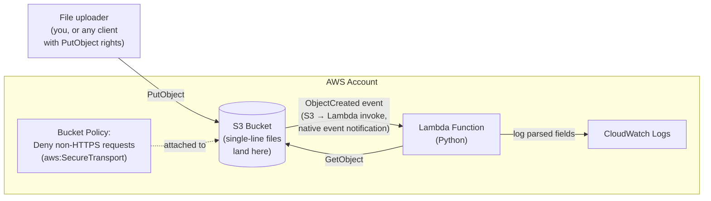
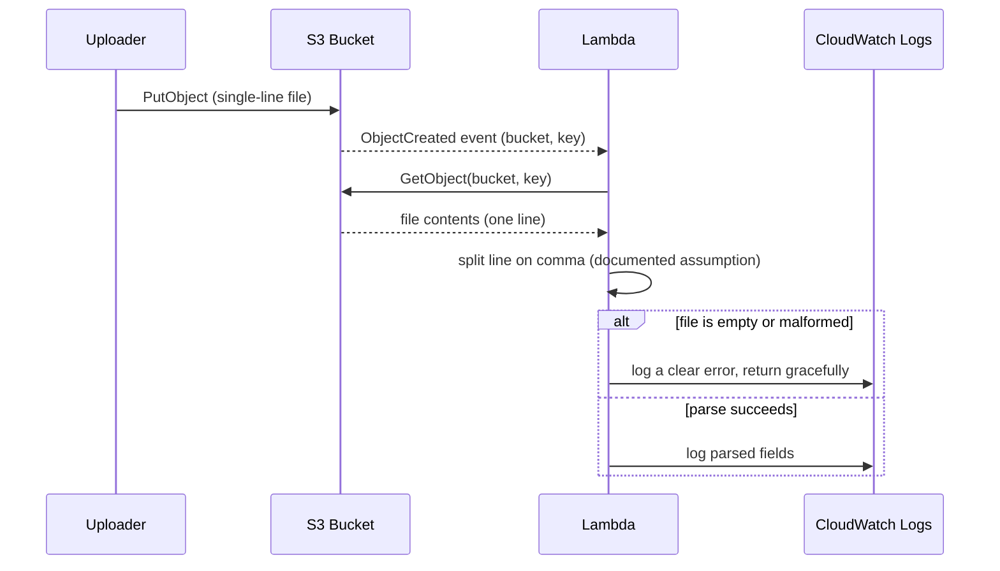

# Sixth Street take-home — S3 + Lambda CDK app — design

## Architecture



**Why S3's native event notification instead of SNS/SQS/EventBridge in between:** for a
single consumer with no fan-out, retry-queue, or cross-account need, that's added
infrastructure the assignment never asked for. S3 → Lambda direct invocation is the
standard, idiomatic CDK pattern for exactly this shape of problem
(`bucket.add_event_notification` + `s3n.LambdaDestination`), and it's the simplest version
to draw and explain.

## Sequence — what actually happens on a file upload



## Components

**S3 bucket** — the landing zone. Default encryption at rest (SSE-S3), versioning off
(not asked for, and would add cost/complexity with no stated need), `block_public_access`
left at its default (fully blocking public access) since nothing in the assignment calls
for public access.

**Bucket policy** — a single explicit `Deny` statement: any request where
`aws:SecureTransport` is `false` is denied. This is a standard, well-known
security-by-default pattern (forces TLS in transit) that's easy to state and justify in one
sentence.

**Lambda (Python)** — triggered on `s3:ObjectCreated:*`. Reads the object via `GetObject`,
decodes it as UTF-8 text, and splits the single line on commas (chosen as the most common,
easy-to-justify plain-text delimiter given the spec names no format). Logs the parsed
fields as structured output to CloudWatch. Wrapped in error handling so an empty or
malformed file logs a clear message and returns cleanly instead of throwing an unhandled
exception — a small, real piece of defensive coding, not overbuilt.

**IAM** — the Lambda's execution role gets exactly `s3:GetObject` scoped to this one
bucket, plus the CDK-managed basic Lambda execution policy (CloudWatch Logs write). No
broader permissions than the function actually uses.

## Repo layout

```
sixth-street-s3-lambda-takehome/
├── README.md                    # deploy/maintain instructions + embedded diagram
├── app.py                       # CDK app entrypoint
├── requirements.txt
├── cdk.json
├── takehome_stack/
│   └── takehome_stack.py        # S3 bucket + bucket policy + Lambda + event wiring
├── lambda/
│   └── handler.py               # the parsing logic
├── tests/
│   └── unit/
│       └── test_takehome_stack.py   # CDK assertions: bucket, policy, Lambda all present
└── .github/workflows/
    ├── ci.yml                   # cdk synth + unit tests on push/PR, no AWS credentials
    └── deploy.yml                # manual, OIDC-authenticated cdk deploy
```

## CI workflow — what it does and doesn't do

The assignment explicitly invites "a basic deployment workflow." Two separate workflows
cover this: `ci.yml` runs automatically on every push/PR — install dependencies, `cdk synth`
to confirm the app synthesizes to valid CloudFormation, and the unit tests — with no AWS
credentials involved at all. `deploy.yml` is manual (`workflow_dispatch` only, not triggered
by pushes) and does a real `cdk bootstrap` + `cdk deploy` against AWS, authenticating via
GitHub Actions' OIDC federation straight to an AWS IAM role — no stored access keys
anywhere in the repo. The stack was in fact live-deployed and tested end-to-end this way,
then torn down afterward to avoid ongoing AWS charges; see the README's "Deploying" section
for the actual verification steps that were run.

## Testing

CDK's own `aws_cdk.assertions` module, asserting the synthesized CloudFormation template
contains: exactly one S3 bucket, a bucket policy with the deny-non-HTTPS statement, and a
Lambda function wired to the right handler. This is fast and requires no AWS account.

## Error handling

- Lambda: catches decode/parse failures, logs a clear message, returns without raising —
  an S3 event Lambda that throws on bad input will just get retried by S3 with the same bad
  input, so failing loud-but-gracefully (log and return) is the right behavior here, not
  a naive `except: pass`.
- No other components need explicit error handling at this scope — the bucket policy and
  event wiring are declarative CDK constructs, not runtime code paths that can fail
  independently of AWS's own reliability.

## Diagram + README

The Excalidraw diagram mirrors the architecture flowchart above (bucket → event →
Lambda → CloudWatch, with the bucket policy called out), exported as a PNG and embedded
directly in the README (`docs/images/architecture.png`). The README covers what this does,
the architecture diagram, deploy steps (`cdk bootstrap`, `cdk deploy`), how to run the
tests, and a "how it works" walkthrough.

## Out of scope (deliberately)

- Terraform Cloud — considered and dropped; the assignment asks for CDK specifically, and
  CDK stays the real, single deployment mechanism.
- Any queue/topic/fan-out infrastructure between S3 and the Lambda — not asked for, would
  add complexity without a stated need.
- DynamoDB or any other destination for the parsed data — the assignment says "process,"
  not "store"; CloudWatch logging is a defensible, simple interpretation of "process."
