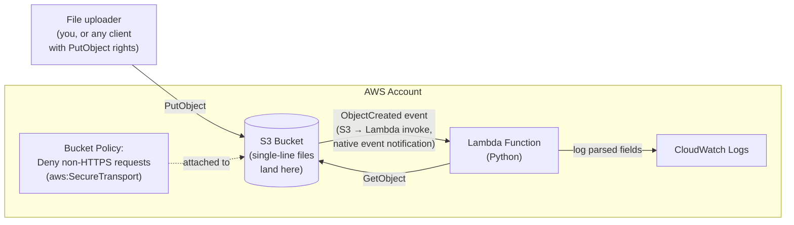
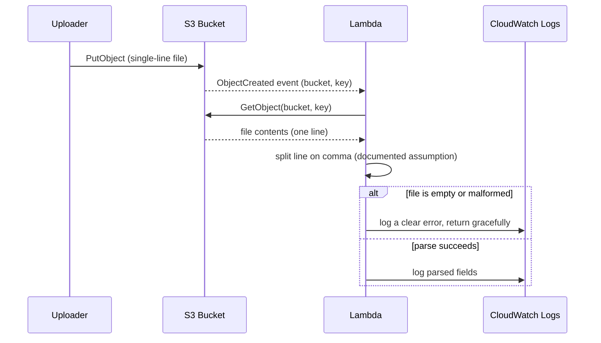

# Sixth Street take-home — S3 + Lambda CDK app — design

**Date:** 2026-09-18
**Deadline:** 9:00 AM CST, Monday 2026-09-21 (submit repo link to Adam Dutko, adutko@sixthstreet.com)
**Defended live:** onsite interview later that same week

## The assignment, as given

1. Write AWS CDK code, in the latest supported version of Python, that creates:
   - An S3 bucket
   - A bucket policy
   - A Lambda (also Python) that processes events from files landing in the bucket. The
     Lambda should parse the contents of a single-line file after it's placed in S3.
2. Use Excalidraw.com to make a basic architecture diagram showing each AWS component and
   the network flows between them. Their explicit note: "detail is good, completeness is
   more important."
3. Embed that diagram in a README at the repo root, with instructions on how to deploy and
   maintain the stack, in a public GitHub repo. Optionally, write a basic deployment
   workflow to walk through live.

## Why this design, in plain terms

The assignment is intentionally light on specifics — it doesn't say what the single-line
file's format is, what the bucket policy should restrict, or how "processing" should show
its result. Rather than guess at hidden requirements, this design picks the simplest
defensible choice for each gap and documents the assumption plainly, both in code comments
and in the README. That's a deliberate strategy: in a live defense, "I assumed X because
the spec didn't define it, and here's why X was reasonable" is a much stronger answer than
either overbuilding for a case that was never asked for, or silently guessing and hoping
nobody asks.

The whole thing is scoped to be buildable and understandable in one sitting, and to read as
something Kolin actually wrote and can explain line-by-line, not a maximalist showcase.

## Architecture



**Why S3's native event notification instead of SNS/SQS/EventBridge in between:** for a
single consumer with no fan-out, retry-queue, or cross-account need, that's added
infrastructure the assignment never asked for. S3 → Lambda direct invocation is the
standard, idiomatic CDK pattern for exactly this shape of problem
(`bucket.add_event_notification` + `s3n.LambdaDestination`), and it's the version that's
simplest to draw, explain, and defend live.

## Sequence — what actually happens on a file upload



## Components

**S3 bucket** — the landing zone. Default encryption at rest (SSE-S3), versioning off
(not asked for, and would add cost/complexity with no stated need), `block_public_access`
left at its default (fully blocking public access) since nothing in the assignment calls
for public access.

**Bucket policy** — a single explicit `Deny` statement: any request where
`aws:SecureTransport` is `false` is denied. This is a standard, well-known
security-by-default pattern (forces TLS in transit) that's easy to state and justify in one
sentence, and it directly demonstrates the same "security defaults, not bolted on later"
instinct that shows up in Kolin's real SCP-validation and CIS-hardening work elsewhere —
worth saying exactly that in the live defense.

**Lambda (Python)** — triggered on `s3:ObjectCreated:*`. Reads the object via `GetObject`,
decodes it as UTF-8 text, and splits the single line on commas (chosen as the most common,
easy-to-justify plain-text delimiter given the spec names no format). Logs the parsed
fields as structured output to CloudWatch. Wrapped in error handling so an empty or
malformed file logs a clear message and returns cleanly instead of throwing an unhandled
exception — a small, real piece of defensive coding, not overbuilt.

**IAM** — the Lambda's execution role gets exactly `s3:GetObject` scoped to this one
bucket, plus the CDK-managed basic Lambda execution policy (CloudWatch Logs write). No
broader permissions than the function actually uses.

## Repo layout

```
sixth-street-s3-lambda-takehome/
├── README.md                    # deploy/maintain instructions + embedded diagram
├── app.py                       # CDK app entrypoint
├── requirements.txt
├── cdk.json
├── takehome_stack/
│   └── takehome_stack.py        # S3 bucket + bucket policy + Lambda + event wiring
├── lambda/
│   └── handler.py               # the parsing logic
├── tests/
│   └── unit/
│       └── test_takehome_stack.py   # CDK assertions: bucket, policy, Lambda all present
└── .github/workflows/
    └── ci.yml                   # cdk synth on push/PR
```

## CI workflow — what it does and doesn't do

The assignment explicitly invites "a basic deployment workflow... so you can walk us
through it." Since there are no live AWS credentials involved in this design (a deliberate
choice made earlier in this session — no live deploy right now), the workflow does what's
honestly possible without credentials: install dependencies, run `cdk synth` to confirm the
app synthesizes to valid CloudFormation, and run the unit tests. The README documents, in
prose, how a real deploy job would authenticate — GitHub Actions OIDC federation straight
to an AWS IAM role, no stored access keys — which mirrors how Kolin already does this at
his day job, and is worth saying explicitly if asked "why isn't this actually deploying in
CI."

## Testing

CDK's own `aws_cdk.assertions` module, asserting the synthesized CloudFormation template
contains: exactly one S3 bucket, a bucket policy with the deny-non-HTTPS statement, and a
Lambda function wired to the right handler. This is fast, requires no AWS account, and
gives a concrete "yes, I tested this" answer if asked live.

## Error handling

- Lambda: catches decode/parse failures, logs a clear message, returns without raising —
  an S3 event Lambda that throws on bad input will just get retried by S3 with the same bad
  input, so failing loud-but-gracefully (log and return) is the right behavior here, not
  a naive `except: pass`.
- No other components need explicit error handling at this scope — the bucket policy and
  event wiring are declarative CDK constructs, not runtime code paths that can fail
  independently of AWS's own reliability.

## Diagram + README

The Excalidraw diagram will mirror the architecture flowchart above (bucket → event →
Lambda → CloudWatch, with the bucket policy called out), exported as a PNG and embedded
directly in the README. The README covers: what this does in two or three sentences, the
architecture diagram, deploy steps (`cdk bootstrap`, `cdk deploy`), how to run the tests,
and a short "how it works" walkthrough written so it reads naturally out loud in the live
defense.

## Out of scope (deliberately)

- Live deployment / a real AWS account — decided against this session, code is written to
  be correct and deployable, not proven-deployed right now.
- Terraform Cloud — considered and explicitly dropped; the assignment asks for CDK
  specifically, and CDK stays the real, single deployment mechanism.
- Any queue/topic/fan-out infrastructure between S3 and the Lambda — not asked for, would
  add complexity without a stated need.
- DynamoDB or any other destination for the parsed data — the assignment says "process,"
  not "store"; CloudWatch logging is a defensible, simple interpretation of "process."
